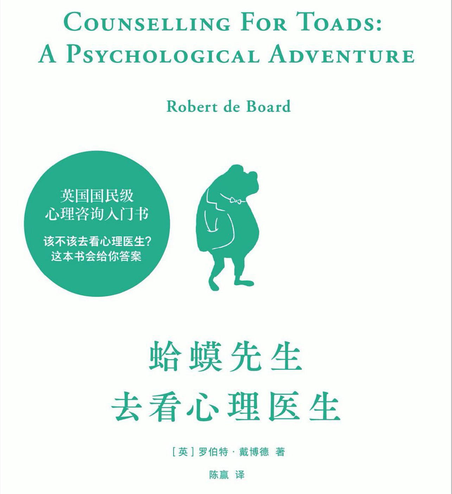

# 蛤蟆先生去看心理医生

Author: Robert de Board
Material: %E8%9B%A4%E8%9F%86%E5%85%88%E7%94%9F%E5%8E%BB%E7%9C%8B%E5%BF%83%E7%90%86%E5%8C%BB%E7%94%9F%201ef5bb9482044cbb93b94aeba41104d4/%E8%9B%A4%E8%9F%86%E5%85%88%E7%94%9F%E5%8E%BB%E7%9C%8B%E5%BF%83%E7%90%86%E5%8C%BB%E7%94%9F_by_%E7%BD%97%E4%BC%AF%E7%89%B9%E3%80%82%E6%88%B4%E4%BC%AF%E5%BE%B7_(z-lib.org).pdf
Publisher: 天津人民出版社
Reading date: March 15, 2022
Status: Reading
Summary: 热情开朗的蛤蟆变得抑郁之后，他的好朋友獾，河鼠和鼹鼠出手相助，并带他去找苍鹫治疗的心路历程
Type: 心理

## 第一章  整个人都不太好了

        作者一上来就对天气气候进行描写，一句话带过由晴转阴暗的天气，并且从蛤蟆的好友鼹鼠身上出发，描写了他跟河鼠的性格以及过往种种。从字里行间，可以看到河鼠的机智灵活以及心灵手巧，并且慷慨大方；反观鼹鼠，从河鼠将它带到河边开始生活，到在生活中处处帮助他，但这并没有唤起他对河鼠的感恩，反而使他认为河鼠是一副高高在上的样子。这可能也跟鼹鼠的性格有关系，在没到河边之前，文中有句话说的是: 

> 他知道，自打他住到了河边，就赢得了他们的尊重，没人会再像以前那样问他收过路费。他们敢！
> 

        字里行间都能感受到鼹鼠软弱的样子。侧面可以看出，生活环境对人的影响非常大，一个饱受欺凌的人，内心总会存在自卑心理，总是过于在意别人的看法，当听到别人的窃窃私语时，总会不由自主的带入自己，认为他们议论的是自己，然后开始胡思乱想：是否有哪里做的不对，衣服穿的不合适或者脸上有什么东西，走路姿势是不是很奇怪之类的。而且总会把别人的帮助视为负担，说负担都是有点过分的，因为鼹鼠总会想的是：接受别人的帮助就说明自己是出于弱势一方的，而帮助自己的人处于强势一方，他们可能会不断地提及这件事情，以此来彰显他们有多么的高大。但是这仅仅是鼹鼠自己的想法。因为强者从来都不会去在意随手所为的帮助。只有弱者才会纠结于小事。

---

        在结束了跟河鼠的对话之后，鼹鼠就去找蛤蟆了，从而引出了主线故事，一上来先描写了蛤蟆的豪华别墅，外表富丽堂皇，但随着步入庄园，直到栖息之地，荒凉之景映入眼帘。就像是蛤蟆本人一样，外表光鲜亮丽，内心却充满了悲伤。文末以一句：“我现在整个人都不太好”结束。