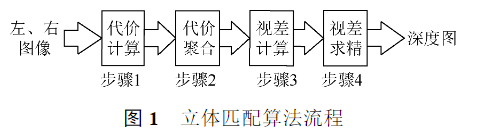

# 综述论文

Created: April 15, 2022 10:47 AM
Reviewed: No

# 第一篇：双目视觉的匹配算法综述

[双目视觉的匹配算法综述_陈炎.pdf](attachments/双目视觉的匹配算法综述_陈炎.pdf)

1. 立体视觉的工作流程：双目标定、图像校正、立体匹配和三维重建。

**影响因素**： 光照不均匀、遮挡、模糊以及噪声。在一些领域中，需要具备实时、准确的深度估计，

由双目相机的成像原理：只需要计算处于同一水平线上的左右图像的像素相似值。 **极约束**。

## 1、基于人工特征的匹配算法

**立体匹配算法的实现流程：** 代价计算、代价聚合、视差计算和视差求精。

- 代价计算：对匹配区域像素点和参考区域进行相似度计算
- 代价聚合：通过设置能量函数，将中心像素点的相似度值用某个范围内的像素点代价计算结果替代。（绝对差之和【SAD】，平方差之和【SSD】，归一化互相关【NCC】，秩变换【RT】，普查变换【CT】）
- 视差计算：选取参考区域内相似度最高的像素点来计算。
- 视差求精：减少错误匹配的像素点，优化视差图。（优化步骤：正则化和遮挡填充或插值）

### 1.1 全局立体匹配算法

其能量函数整合了图像中的所有像素，以尽可能多的获得全局信息。

通常是先找出图像中显著的特征点、特征线或者扫描线，初步匹配得出一个初始的视差值，然后使用全局能量函数进行约束，通过匹配算法不断地对分配的视差值迭代优化，直到最优。此迭代优化的过程以全局能量函数最小化为目的。

$E_d=E_{data}(D)+\lambda·E_{smooth}(D)$ 

### 1.2 局部立体匹配算法

将参考图像分为若干图像块，再求取匹配图像内预期相似度最高的图像块，生成深度图。

## 2、基于深度学习的匹配算法

深度学习通过卷积、池化、全连接等操作，对图像进行非线性变换，提取图像的多层特征用于代价计算。深度学习的方法更多地利用了图像的全局信息，通过预训练获得模型参数，提高了算法地鲁棒性。用于立体匹配地图像网络主要可分为**金字塔网络、孪生网络和生成对抗网络。**

### 2.1 图像金字塔网络

1. 为了保持输入尺寸的一致性，再卷积层和全连接层之间设置了空间金字塔池化层，将不同尺寸的图片特征转化为固定长度地表示，避免了卷积地重复计算。
2. 将金字塔池化模块引入到特征提取中，使用**多尺度分析和3D-CNN**结构，有效的解决了梯度消失和梯度爆炸地问题，在弱纹理、遮挡、光照不均匀等条件下获得了良好的效果。

### 2.2 孪生网络

通过设置两个权重共享地卷积神经网络，分别输入左、右图像，通过映射函数将卷积得到地特征转化为特征向量，衡量2个特征向量间地L1距离就可以拟合2张图片地相似度。

### 3.2 生成对抗网络

网络由生成模型和判别模型构成。生成模型学习样本特征，生成图像与原图像相似，而判别模型则用来分辨“生成”图片与真实图片。这个过程不断迭代运行，最终判别结果达到纳什均衡，即真假概念均为0.5。

**立体匹配算法主要有 *Midelebury* 和 *KITTI* 两个测评数据集。**

# 第二篇：双目立体视觉匹配技术综述

[中国知网-登录](https://kns.cnki.net/KXReader/Detail?invoice=pjwQwwYK41e5EKT4zJW9JHxYoQIscWnyz8pbuHetH%2F5MoV3upqfTl%2B9IoJ4rYImXHLTxg7CBIGr5sCfAvV9RDT%2BZa9aE%2BM3%2BUDAGFjAT%2Bx0d6pkmQSq2kFk4GEQalfAh%2F%2BHtP08cqMDpHuLz3PWrdPAeoK63oNPxVDO5M%2FmAZd0%3D&DBCODE=CJFD&FileName=CGGL201502014&TABLEName=cjfdlast2015&nonce=38451E42A6914432AFFBD0C9CC76C701&uid=&TIMESTAMP=1649997495336)

## 1、双目立体视觉系统

$O_l$和$O_r$为相机位置，P为观测点，则第三维（深度）的测量为：$**Z=\frac{b·f}{d}**$ ，其中 $f$ 为焦距，$d$ 为视差，即 $P_l$ 和 $P_r$ 两图像在 X 轴方向上的差值，深度为 Z。基线 b 和焦距 f 可在双目标定时计算得出。因此，双目立体视觉定位的核心内容是对视差 d 的计算。视差 d 由立体匹配得出。

### 1.1 立体匹配约束

1. 唯一性约束：三维空间中的点映射到左右摄像头时，只会在图像上映射出唯一的对应点。在匹配时左右图像只有唯一一点相匹配
2. 连续性约束：三维空间中的物体一般是连续光滑的，在映射到左右摄像头时这种特性也被保留下来。在连续的图像上，其视差也一般是连续的。
3. 极线约束：对于一个图像上的映射点来说，其匹配点必定落在另一副图像的极线上。点在图像中的坐标 y 值相等
4. 顺序一致性约束：三维空间中点的位置关系会在映射到成像平面时保留下来，即原物体的位置顺序在两幅图像中不会改变。

### 1.2 立体匹配的匹配基元

匹配基元是立体匹配中的单位匹配对象，也就是立体匹配中的匹配特征对象。最常用的特征就是点特征，例如像素点的灰度、颜色值、Harris角点、SIFT特征点等。  **点、块、线**。 线一般为边缘线。

